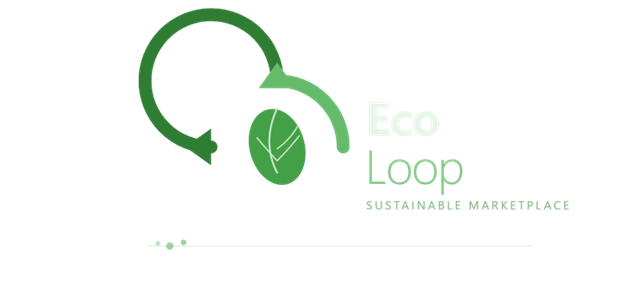

  

## Ecoloop
EcoLoop is a sustainability-focused open-source marketplace designed to promote reuse and reduce environmental waste. It allows startups to list eco-friendly products while also enabling individuals to sell or give away unused items at minimal or no cost.

##  Getting Started

Follow these steps to run the project locally:

### Prerequisites
- Node.js installed
- Git installed

### Installation

1. Clone the repository:
   git clone https://github.com/RajMajhi/Ecoloop_GsSOC-2026.git

2. Navigate to the project folder:
   cd Ecoloop_GsSOC-2026

3. Install dependencies:
   npm install

4. Run the development server:
   npm run dev

The application should now be running locally.

# Folder Structure

## 📁 Project Structure Explaination

Ecoloop_GsSOC-2026/
│── client/        # Frontend (React / Next.js)
│── server/        # Backend (Node.js / Express)
│── docs/          # Documentation files
│── .github/       # GitHub-specific configurations
│── README.md
│── CONTRIBUTING.md
│── CODE_OF_CONDUCT.md

##  .github Folder Explained

This folder contains configurations to streamline contributions:

- ISSUE_TEMPLATE → Predefined templates for bug reports and feature requests  
- PULL_REQUEST_TEMPLATE.md → Standard format for submitting pull requests  
- FUNDING.yml → Optional funding/sponsorship configuration  

#  EcoLoop – Sustainable Marketplace

EcoLoop is an open-source platform promoting sustainable living by enabling users to buy, sell, or donate unused items while supporting eco-friendly startups.

These help maintain consistency and improve collaboration.
##  Features
- List eco-friendly products
- Sell or donate unused items
- Search & filter listings
- User authentication
- Community-driven contributions

##  Vision
To build a circular economy platform that reduces waste and promotes reuse.

##  Tech Stack

- JavaScript / TypeScript
- Frontend: React / Next.js
- Backend: Node.js
- Database: MongoDB (planned)
- AI/ML (for future scope 👀)
  
## 🤝 Contributing
We welcome contributors of all levels!
Check `CONTRIBUTING.md` to get started.

## Beginner Friendly
Look for issues labeled `good first issue`.

##  Impact
Reducing waste, promoting reuse, and supporting sustainable businesses.

